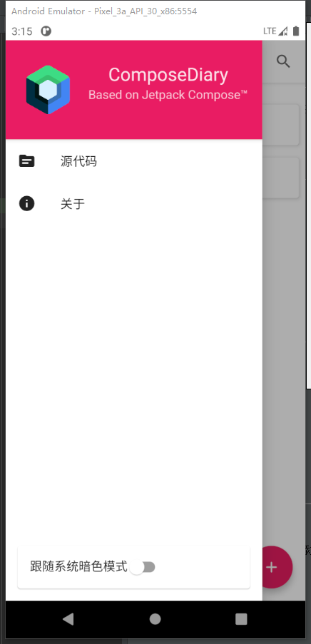

# ComposeDiary
基于Jetpack Compose开发的日记APP, 采用navigation库进行单activity实现  
A simple diary app build by Jetpack Compose, use navigation library for single activity implementation

## 技术栈和功能
* 纯 Jetpack Compose 构建界面 | Pure Jetpack Compose UI
* 支持 添加/删除/编辑/搜索 日记 | Support Add/Delete/Edit/Search diaries
* MVVM架构 | MVVM Architecture
* Kotlin Coroutine/Room/Navigation
* 支持夜间模式(自动切换) | Dark Mode

## 截图
| 主页面 | 侧边栏 |
| ----- | ------|
| | |

## TODO List
* 页面切换动画 (等待navigation库添加该功能) | Page Navigation Animation
* 解决编辑页面的直接返回处理 | Back handling in edit page
